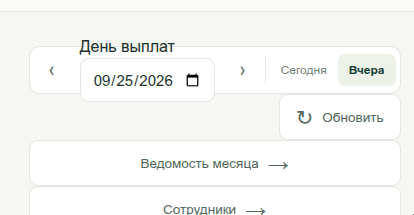
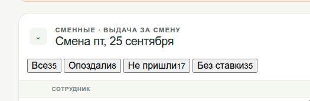
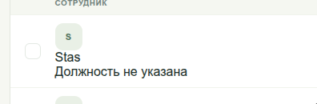

# T-006 — Исправление неточностей дизайна (retro-villain)

## Контекст

Прошёл беглый просмотр трёх экранов retro-villain — шапки «День выплат», блока
смены с фильтрами и строки сотрудника. Функционально всё работает, но накопились
мелкие дефекты вёрстки и оформления: американский формат даты в русском
интерфейсе, слипшиеся счётчики в чипах, отсутствие визуальной иерархии в строке
сотрудника, разъезжающиеся отступы.

По отдельности каждый пункт — мелочь. Вместе они читаются как «интерфейс собран
на скорую руку», а этим экраном каждый день пользуется бухгалтерия. Задача —
пройти по списку и закрыть всё разом, одним PR.

**Это задача на полировку, не на редизайн.** Не переставляй блоки, не меняй
информационную архитектуру, не вводи новые сущности. Если по ходу увидишь, что
какой-то пункт требует перестройки компонента, а не правки стилей — не делай
сам, опиши в разделе «Заметки от Amir» и спроси Bekhruz.

**Продукт:** [[../_Hub]]
**Скриншоты:** `Tasks/assets/T-006/`

---

## Что нужно сделать

### Блок 1 · Шапка «День выплат»

1. **Формат даты.** Поле показывает `09/25/2026` — это `MM/DD/YYYY`, американский
   формат, в русском интерфейсе. Должно быть `25.09.2026`. Нативный
   `<input type="date">` рендерит формат по локали браузера, поэтому либо
   принудительно задай локаль, либо замени на кастомный date-picker с явным
   форматом `ДД.ММ.ГГГГ`. **Выбор реализации — за тобой**, но результат должен
   быть одинаковым в Chrome, Safari и Firefox.
2. **Подпись «День выплат»** налезает на верхнюю границу карточки и обрезается.
   Либо полноценный floating label с фоном-подложкой по границе, либо вынести
   подпись над карточкой. Сейчас это выглядит как баг, а не как приём.
3. **Стрелки `‹` и `›`** (предыдущий/следующий день): мелкие, без видимой зоны
   клика, не выровнены по вертикальному центру поля. Сделай кликабельную область
   не меньше 40×40 px, выровняй по центру поля, добавь hover/active состояние и
   `aria-label` («Предыдущий день» / «Следующий день»).
4. **Переключатель «Сегодня / Вчера»**: два пункта живут как отдельные элементы с
   разными отступами. Собери в один segmented control — общий контейнер, равные
   паддинги у сегментов, единый радиус, активный сегмент залит, неактивный —
   кликабельный текст с hover.
5. **Кнопка «Обновить»** висит справа вне сетки — её правый край не совпадает ни
   с карточкой даты сверху, ни с карточками навигации снизу. Выровняй по общей
   сетке контента.
6. **Карточки «Ведомость месяца →» и «Сотрудники →»**: текст отцентрован, а
   стрелка приклеена к тексту. Выбери один паттерн и примени к обеим — либо текст
   слева и стрелка прижата к правому краю карточки (обычная строка-ссылка), либо
   центрованная группа «текст + стрелка». Вариант со стрелкой у правого края
   предпочтительнее — он масштабируется, когда карточек станет больше.
7. **Вертикальный ритм**: между блоками сейчас разные зазоры. Приведи к шагу
   сетки (8 px или тот, что уже используется в проекте — проверь существующие
   переменные, не вводи новые без нужды).

### Блок 2 · Блок смены и фильтры

8. **Счётчики в чипах слиплись с подписями**: `Все35`, `Опоздали8`,
   `Не пришли17`, `Без ставки35`. Отдели счётчик — либо пробелом и другим
   цветом/весом, либо отдельным badge-кружком внутри чипа. Единый приём на все
   четыре чипа.
9. **У чипов нет активного состояния.** Непонятно, какой фильтр выбран и
   выбран ли вообще. Добавь явное состояние «выбран» (заливка + контраст текста)
   и hover.
10. **Семантика статусов.** «Опоздали» и «Не пришли» — проблемные состояния, а
    выглядят так же нейтрально, как «Все». Добавь сдержанный цветовой акцент
    (например, счётчик в цвете статуса, сам чип остаётся нейтральным). **Не
    раскрашивай чип целиком** — четыре разноцветных чипа подряд станут шумом.
11. **Заголовок «Смена пт, 25 сентября»** — сокращение дня недели слитно с датой
    читается тяжело. Сделай `Смена · пятница, 25 сентября` (или `пт, 25 сентября`
    с разделителем). Согласуй формулировку с форматом даты из пункта 1.
12. **Надзаголовок «СМЕННЫЕ · ВЫДАЧА ЗА СМЕНУ»**: капс с низким контрастом и без
    межбуквенного интервала. Добавь `letter-spacing`, подними контраст до
    WCAG AA (4.5:1 для основного текста, 3:1 — если оставляешь как decorative
    label меньше 14 px и жирнее).
13. **Иконка сворачивания** (`⌄` в рамке слева от заголовка) не читается как
    интерактивный элемент. Увеличь зону клика, добавь hover, поворот иконки при
    раскрытии и `aria-expanded`.
14. **Заголовок таблицы «СОТРУДНИК»** не выровнен по левому краю с содержимым
    строк ниже — колонка с чекбоксом не учтена в шапке. Выровняй колонки.

### Блок 3 · Строка сотрудника

15. **Нет иерархии между именем и должностью.** «Stas» и «Должность не указана»
    одного размера, веса и цвета. Имя — основной текст (медиум/полужирный),
    должность — вторичный (меньше на ступень, приглушённый цвет).
16. **«Должность не указана» — это пустое состояние**, а выглядит как данные.
    Оформи как placeholder: приглушённый цвет, можно курсив или прочерк «—».
    Финальную формулировку согласуй, если решишь менять текст.
17. **Инициал в аватаре** не отцентрован в круге и имеет низкий контраст
    (тёмно-зелёный на светло-зелёном). Отцентруй по обеим осям, доведи контраст
    до AA.
18. **Чекбокс** выровнен по верху строки, а не по её вертикальному центру.
    Выровняй по центру; зона клика — не меньше 40×40 px, и клик по ней не должен
    открывать карточку сотрудника.
19. **Межстрочный интервал** между именем и должностью зажат. Дай воздуха в
    пределах шага сетки.
20. **Латиница в данных.** Имя отрисовано как `Stas`. Если это транслитерация при
    выводе — почини на стороне UI. Если так лежит в базе — **не трогай данные**,
    напиши об этом в «Заметках от Amir», это отдельная задача.

---

## Определение готовности (Definition of Done)

- [ ] Дата в поле «День выплат» отображается как `25.09.2026` в Chrome, Safari и Firefox (пп. 1)
- [ ] Подпись «День выплат» не обрезается и не налезает на границу карточки (п. 2)
- [ ] Стрелки дня: зона клика ≥ 40×40 px, выровнены по центру поля, есть hover/active и `aria-label` (п. 3)
- [ ] «Сегодня / Вчера» — единый segmented control с равными паддингами (п. 4)
- [ ] «Обновить» и карточки навигации выровнены по одной сетке с карточкой даты (пп. 5, 7)
- [ ] Карточки «Ведомость месяца» и «Сотрудники» используют один паттерн расположения стрелки (п. 6)
- [ ] Во всех четырёх чипах счётчик визуально отделён от подписи (п. 8)
- [ ] У чипов есть состояния hover и «выбран» (п. 9)
- [ ] «Опоздали» и «Не пришли» имеют цветовой акцент на счётчике, чипы не залиты цветом целиком (п. 10)
- [ ] Заголовок смены и надзаголовок переоформлены, контраст проверен и проходит WCAG AA (пп. 11, 12)
- [ ] Иконка сворачивания: увеличенная зона клика, hover, поворот при раскрытии, `aria-expanded` (п. 13)
- [ ] Шапка таблицы выровнена по колонкам строк (п. 14)
- [ ] Имя и должность различаются размером/весом/цветом; пустое состояние оформлено как placeholder (пп. 15, 16, 19)
- [ ] Инициал в аватаре отцентрован, контраст проходит AA (п. 17)
- [ ] Чекбокс по центру строки, зона клика ≥ 40×40 px, клик не открывает карточку (п. 18)
- [ ] Скриншоты «до / после» по каждому из трёх экранов приложены к PR
- [ ] Проверено на ширине 360 px (мобильный), 768 px и десктопе — ничего не переносится и не обрезается
- [ ] Ни одно изменение не затронуло бизнес-логику: подсчёты, фильтрация и выборка данных работают как прежде

---

## Что уже есть / на что можно опираться

- Скриншоты текущего состояния: `Products/retro-villain/Tasks/assets/T-006/`
- Существующие CSS-переменные / токены проекта — **сначала посмотри, что уже
  есть**, и переиспользуй. Новые токены вводи только если без них не обойтись, и
  отметь это в PR.
- Правило из `README.md`: **UI на русском.** Форматы даты, подписи, сокращения —
  всё по-русски.
- WCAG AA: 4.5:1 для обычного текста, 3:1 для крупного (≥ 18.66 px или ≥ 24 px).

---

## План тестирования

- **Ручные проверки:** пройти по всем 20 пунктам на трёх ширинах (360 / 768 /
  десктоп), сверяясь со скриншотами «до».
- **Дата:** открыть экран в Chrome, Safari и Firefox — во всех трёх формат
  `ДД.ММ.ГГГГ`. Отдельно проверить переключение дня стрелками через границу
  месяца (например, 01.10 → 30.09).
- **Клавиатура:** пройти весь экран табом — стрелки дня, «Сегодня/Вчера», чипы,
  сворачивание блока, чекбоксы должны получать фокус с видимым focus ring и
  срабатывать по Enter/Space.
- **Контраст:** прогнать изменённые пары цветов через любой contrast checker,
  результаты приложить к PR.
- **Граничные случаи:** длинное имя сотрудника (30+ символов), пустой список,
  счётчик из 3–4 цифр в чипе, сотрудник с заполненной должностью.
- **Автотесты:** визуальных тестов в проекте нет — не заводи их в рамках этой
  задачи. Если в проекте есть snapshot-тесты, обнови их.

---

## Зависимости / блокируется

- Не блокируется ничем.
- **Вопрос к Bekhruz (не блокирует старт):** на скриншоте счётчики не сходятся —
  «Все 35», при этом «Опоздали 8» + «Не пришли 17» = 25, а «Без ставки 35»
  совпадает с общим числом. Похоже на дефект логики подсчёта, **но это не часть
  этой задачи** — Amir только фиксирует наблюдение, чинить не нужно.

---

## Вне scope

- **Никакого редизайна.** Не переставлять блоки, не менять информационную
  архитектуру, не добавлять и не убирать элементы.
- **Не трогать бизнес-логику**: подсчёт счётчиков, фильтрацию, выборку смен и
  выплат.
- **Не чинить расхождение в счётчиках** (см. «Зависимости») — это отдельная
  задача.
- **Не менять данные в базе** (в т.ч. латиницу в именах сотрудников).
- **Не заводить дизайн-систему / UI-kit** в рамках этой задачи. Если по ходу
  станет ясно, что без неё дальше нельзя — напиши Bekhruz, заведём отдельную
  спецификацию.
- Экраны «Ведомость месяца» и «Сотрудники» (вторые уровни) — в этой задаче не
  трогаем, только карточки-ссылки на них с главного экрана.

---

## Заметки от Amir

> Пиши сюда блокеры, вопросы, скриншоты и всё странное, что находишь.

---

## Завершение

> Заполняется при закрытии задачи. **Генерируется AI** из git-истории между
> `commit_initial` и `commit_final` (см. `_Skills/complete-task.md`).

> (пусто до завершения)

## История изменений
- 2026-09-26 — создано Bekhruz'ом по итогам просмотра трёх экранов retro-villain.
